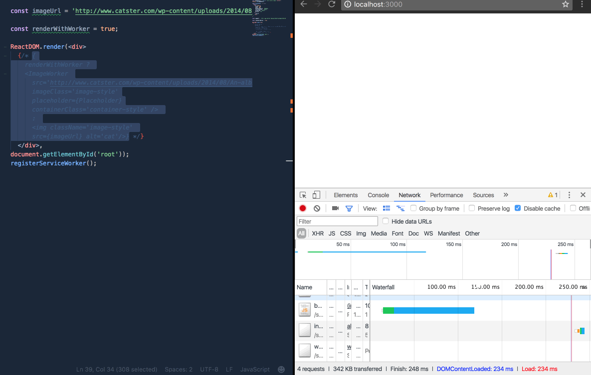

# react-worker-image
[](https://travis-ci.org/nitish24p/react-worker-image)
React component to fetch image resources via web workers

[react-worker-image](https://www.npmjs.com/package/react-worker-image) is a React component for loading images via a web worker. Thereby not blocking the main thread and speeding up page load time.

## Installation
Using npm

```bash
npm install react-worker-image

yarn add react-worker-image
```

## Usage

`react-worker-image` exports one react component which takes `src` as a prop, and an optional prop of `placeholder`, `style` and `imageClass` which are applied to the img tag.

```js
const ImageWorker = require('react-worker-image').default;

or

import ImageWorker from 'react-worker-image';

```
usage in code
```jsx
<ImageWorker src='http://image-url' />
```

## Props List


| Prop type        | Required           | type  |
| ------------- |:-------------:| --------------:|
| src      | yes |  string |
| placeholder      | optional      |   string or Component|
| style | optional     |    Object |
|imageClass | optional | string
|containerClass | optional | string
|onLoad | optional | function

The above props are applied to the img tag.

Found a bug file them [here](https://github.com/nitish24p/react-worker-image/issues).

>Component in Action

Observe the page Load time at the bottom right corner in both cases.

The first is via a webworker and the second is the regular get.



